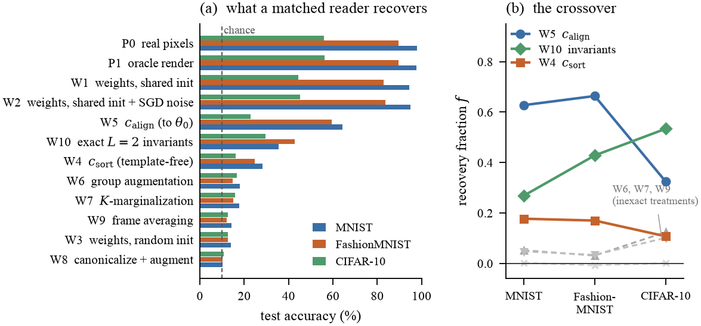
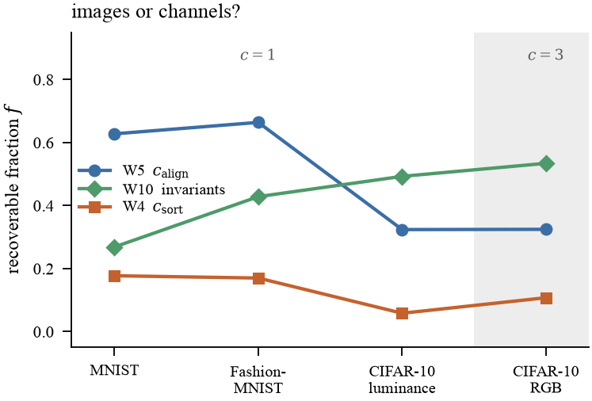
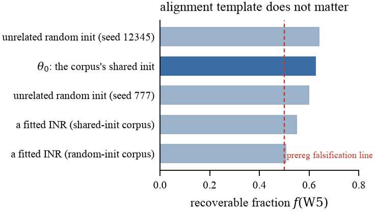
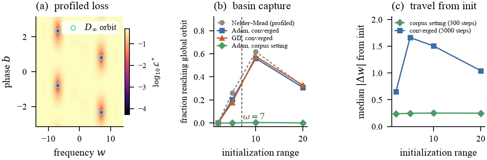
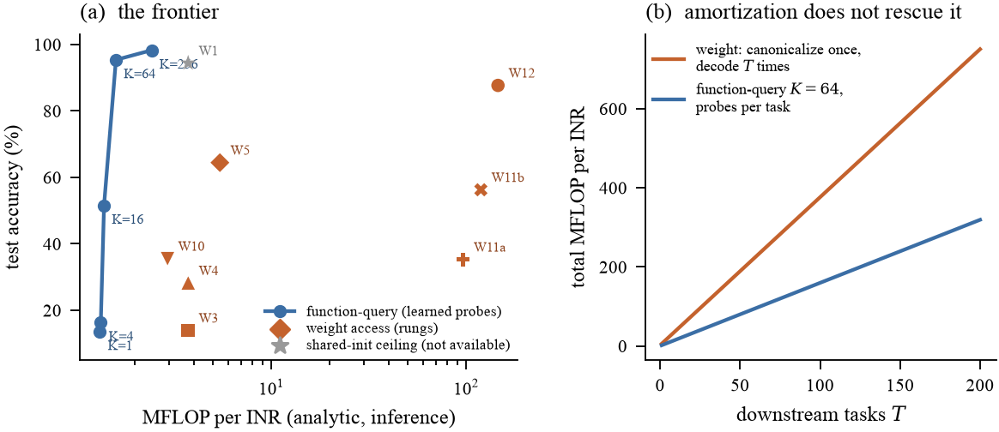
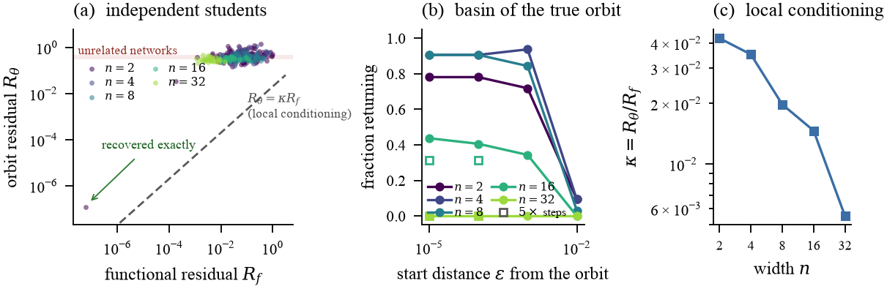
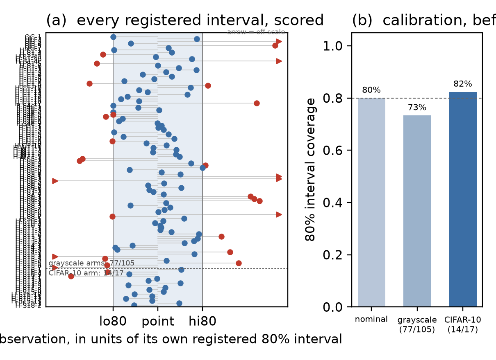

# How Much of the Weight-Space Perception Gap Is Symmetry?

### Evidence from Sine Networks

 [pre-registrations](docs/prereg/) ·  [lab notebook](docs/LAB_NOTEBOOK.md) ·  [prediction ledger](docs/PREDICTION_OUTCOMES.csv) ·  [claims](docs/CLAIMS.md)

---

## Abstract

A classifier reading the raw weights of independently fitted implicit neural representations
(INRs) performs near chance, while the same classifier reading weights fitted from a *shared*
initialization performs almost as well as it does on pixels. This **perception gap** is the
central obstacle of weight-space learning, and it is usually attributed, without measurement, to
parameter symmetry. This work tests that attribution.

Prior work uses two function-preserving transformations of sine networks — neuron negation and
integer-π bias shifts — as weight-space *augmentations* [[13]](#ref13), and a monomial-matrix
framework covers the sign symmetry of $\sin$. We characterize the **group they generate**: the
per-neuron closure is the infinite dihedral group $D_\infty$, whose phase component is *affine* and
therefore outside every monomial action, so the layer group is $D_\infty \wr S_n$. We prove this
group is **maximal** at one hidden layer (generic identifiability, full proof in Appendix A); the
sine instance of the continuous-canonicalization obstruction follows, as does the observation that
complete invariants are informationally equivalent to function access. We then construct a finite
family of **exact** invariants for two-layer sine networks by coupling the layers through the
second-layer Gram matrix — closing a gap that per-neuron constructions leave open. Against this
theory we run a pre-registered decomposition ladder on ~1.8M fitted INRs across MNIST,
FashionMNIST and CIFAR-10.

Which components are ours and which are inherited is stated component by component in
[docs/PROVENANCE.md](docs/PROVENANCE.md) and reproduced as a table in the paper.

**Exact orbit-valued *reframing* recovers 63%, 66% and 32%** of the shared-versus-random accuracy
gap. A nonlinear invariant *encoding* recovers 27%, 43% and 53%; the two families are reported
apart, and a **matched non-invariant control** — the same monomials at the same trigonometric
orders, same pooling, same dimension, same reader, with only the parity classes swapped so it stays
permutation-invariant and is broken only in $D_\infty$ — separates the encoding's gain from ordinary
nonlinear feature engineering. These are **algorithm-relative recoverable fractions, not causal shares** — an
exact reframing creates no function-level information, but it can still route an orbit-invariant
property into a coordinate the reader finds accessible. The causal quantity is measured separately
(§6), by randomizing the group while holding each network and its function fixed.

**Acting on the group characterization closes most of the gap.** A reader that quotients
$D_\infty \wr S_n$ on the **raw** parameters — bias phasors reduce the infinite winding to a parity,
leaving a finite grading preserved layer by layer — recovers **0.917** at matched capacity, against
0.628 for the best reframing, 0.526 for the same reader family fed a fixed invariant front-end, and
0.265 for a permutation-equivariant one. That reverses a claim this README previously made, and a
pre-registration required us to withdraw rather than qualify it (§10).

**Randomizing the group costs 79.1 of the 80.4 points.** Scatter within the group is therefore
*sufficient* to reproduce almost the whole degradation. That is not the same as showing symmetry
mediates the naturally occurring gap, and this experiment does not identify that fraction — we
report sufficiency and stop there. An exactly $G$-invariant reader does still lose points between
the two corpora, but how many is a property of the reader: **28.6** for the equivariant reader over
invariants, **7.8** for the stronger phasor-graded one. The smaller figure is reported as that
reader's shared-versus-random difference, not as a bound on a latent non-symmetry share, since no
such quantity is defined here and an unconstrained infimum over invariant readers would be vacuous
(a constant classifier achieves zero). Within the group, per-neuron sign flips carry ~63 of the 79 points, neuron relabelling
~15, and integer phase shifts ~1.

We hunt for a counterexample to identifiability at depth two and find none: one student recovers its
teacher's parameters to **seven significant figures** at width 2, while at production width the
optimiser leaves the true orbit even when started on it.

**Finally we price the comparison.** On a FLOPs-matched frontier, classifying an INR by *querying*
it at 64 learned coordinates reaches **95.3% for 1.6 MFLOP** where the best weight-space rung
reaches **64.4% for 5.5 MFLOP**, and amortizing the canonicalization over many downstream tasks
does not close the gap. At this scale, weight-space learning is dominated on both axes.

---

## 1. Introduction

An implicit neural representation encodes a signal as the weights of a small network fitted to
it [[1]](#ref1), [[2]](#ref2). Once a dataset of signals has become a dataset of *weight vectors*,
it is natural to ask whether a downstream model can read semantics — a class label, a shape
property — directly off those weights. A large and fast-moving literature builds architectures for
exactly this [[3]](#ref3), [[4]](#ref4), [[5]](#ref5), [[6]](#ref6), [[7]](#ref7).

The field runs into one stubborn empirical fact:

> Fit every INR in a corpus from the **same** initialization, and a plain MLP reading the flattened
> weights nearly matches a pixel classifier. Fit each INR from its **own** random initialization —
> the setting any realistic collection of independently trained models is in — and the same reader
> collapses to a few points above chance.

We call the difference the **weight-space perception gap**. On MNIST it is **80.4 accuracy points**
between two corpora of networks fitted to *the same images*, with the same architecture, differing
only in whether the initialization was shared.

The standard explanation is nuisance variability from parameter symmetry. It is plausible, it
motivates most of the equivariant architectures above, and — to our knowledge — it had never been
*measured* against the alternative: that independent fits land in genuinely different loss basins
whose difference is **not** a group action, and therefore cannot be removed by any
canonicalization, augmentation, or equivariant layer.

This work measures it.

---

## 2. The symmetry group of sine networks

A sine network in canonical form is

$$h^0 = x, \qquad h^\ell = \sin\!\big(W^\ell h^{\ell-1} + b^\ell\big), \qquad f_\theta(x) = W^{L+1}h^L + b^{L+1}.$$

For a hidden neuron write $w$ for its incoming row, $b$ for its bias, $u$ for its outgoing column.

**Definition (per-neuron maps).**
$\tau_k:(w,b,u)\mapsto(w,\,b+2\pi k,\,u)$; $\quad\rho:(w,b,u)\mapsto(w,\,b+\pi,\,-u)$;
$\quad\sigma:(w,b,u)\mapsto(-w,\,-b,\,-u)$.

**Lemma (normal form).** Every element of $\langle\tau_1,\rho,\sigma\rangle$ acts as

$$g_{d,j}\colon (w,b,u)\ \longmapsto\ \big((-1)^d w,\ (-1)^d b + \pi j,\ (-1)^{d+j} u\big),\qquad d\in\{0,1\},\ j\in\mathbb{Z},$$

with composition $g_{d_2,j_2}\circ g_{d_1,j_1}=g_{\,d_1\oplus d_2,\ j_2+(-1)^{d_2}j_1}$. Hence the
per-neuron group is $\mathbb{Z}\rtimes\mathbb{Z}_2 = D_\infty$, the **infinite dihedral group**.

**Theorem 1 (symmetry group).** The function is exactly preserved by every $g_{d,j}$ at every
hidden neuron and every joint permutation of a layer's neurons, so

$$G \;=\; \prod_{\ell=1}^{L} D_\infty \wr S_{n_\ell} \;=\; \prod_{\ell=1}^{L}\big(D_\infty^{\,n_\ell}\rtimes S_{n_\ell}\big)$$

acts with $f_{g\cdot\theta}=f_\theta$, and distinct layers' actions commute.

*Proof.* With $z=\langle w,h\rangle+b$,
$(-1)^{d+j}u\sin\!\big((-1)^d z+\pi j\big)=(-1)^{d+j}(-1)^j(-1)^d u\sin z = u\sin z$. ∎

> **Why the literature misses this.** The phase generators $g_{0,j}$ ($j\neq0$) are **affine**, not
> linear. Classifications of weight-space symmetry restricted to monomial-matrix (linear) actions
> [[8]](#ref8) provably cannot see them — which is exactly why their maximality question for the
> sine case was left open.

### 2.1 Identifiability, impossibility, and a ceiling on the field

Let $\Theta_{\mathrm{gen}}$ be the parameters with all $w_i\neq0$, all $u_i\neq0$, and no parallel
pair $w_j=\pm w_i$.

**Theorem 2 (generic identifiability, $L=1$).** If $\theta,\theta'\in\Theta_{\mathrm{gen}}$ and
$f_\theta=f_{\theta'}$ on some open set, then the widths agree and $\theta'=g\theta$ for a
**unique** $g\in D_\infty\wr S_n$.

The proof passes to the distributional Fourier transform, where the network is an atomic measure

$$\widehat{f_\theta} \;=\; \beta\,\delta_0 \;+\; \sum_{i=1}^{n}\frac{u_i}{2\mathrm{i}}\Big(e^{\mathrm{i}b_i}\delta_{w_i} - e^{-\mathrm{i}b_i}\delta_{-w_i}\Big),$$

whose $2n$ support points are distinct and nonzero exactly on $\Theta_{\mathrm{gen}}$. So
$D_\infty\wr S_n$ is a **maximal** symmetry group at one hidden layer. The result is
non-asymptotic: the only hypothesis is an explicit, *measurable* genericity condition, which we
audit on every corpus.

**Proposition 3 (no continuous canonicalization).** No continuous
$\kappa:\Theta_{\mathrm{gen}}\to\Theta_{\mathrm{gen}}$ picks an orbit representative invariantly.
*Proof:* the path $\theta_t=(1,t,1)$, $t\in[0,2\pi]$, has $\theta_{2\pi}=\tau_1\theta_0$, but
continuity pins $d$ and $j$ constant, forcing a bias mismatch of $2\pi$. ∎

This is the sine instance of the general obstruction of [[9]](#ref9), and it is *stronger* than the
permutation case: for permutations the obstruction is confined to sorting-key ties, whereas the
$\tau$-circle makes it global.

**Proposition 4 (completeness is function access).** Any $G$-invariant, *complete* invariant
factors through the realization map $\theta\mapsto f_\theta$.

**Corollary.** A complete-invariant weight-space perceiver receives *exactly* the information of a
function-space perceiver. Any advantage of weight access must be **computational** (amortization),
or must come from deliberately **incomplete** invariants. This is a ceiling on the enterprise, not
a refutation — but it means the justification has to be stated in the currency of compute.

### 2.2 Exact invariants at depth two (new)

The separating per-neuron invariant on $\{w\neq0,u\neq0\}$ is

$$\Phi(w,b,u)=\Big(w\otimes w,\ \cos 2b,\ (\sin 2b)\,w,\ (\sin b)\,u,\ (\cos b)(w\otimes u)\Big),$$

and note that the features one would *guess* — $\cos(2b)(w\otimes u)$, $\sin(2b)(w\otimes u)$ —
are **not** invariant (wrong bias frequency for $\rho$; wrong parity for $\sigma$). Both are
refuted numerically in the test suite.

$\Phi$ is scoped to $L=1$: at depth two a hidden neuron's outgoing $u_i$ is a *column of a matrix
the next layer's group also acts on*, so per-neuron constructions fail. **Our repair couples the
layers through the second-layer Gram** $G_2=W_2^\top W_2$, which is invariant under the *entire*
layer-2 group and picks up $\varepsilon_i\varepsilon_l$ under layer 1 with
$\varepsilon_i=(-1)^{d_i+j_i}$. Since $\sin b_i$ carries exactly $\varepsilon_i$ and
$\cos b_i\,w_i$ carries $\varepsilon_i$ after contraction, the matrices

$$A=(\sin b_i\sin b_l)G_2,\qquad B=(\cos b_i w_i\cdot\cos b_l w_l)G_2,\qquad C=(\sin 2b_i w_i\cdot\sin 2b_l w_l)$$

are sign-cancelling and transform as $M\mapsto PMP^\top$, so their **sorted eigenvalue spectra are
invariant under the full product group**. Verified numerically at **3×10⁻⁷ relative** residual
under random group elements (windings $|j|\le3$, non-trivial permutations) — fp32 round-off, not
tolerance slack.

---

## 3. INR-Bench: corpora that differ in exactly one nuisance

One SIREN per image ($L=2$, width 32, $\omega_0$ absorbed), under four protocols that intervene on
the arguments of the fit map $F:(y,\theta_0,\xi)\mapsto\theta_T$:

| protocol | $\theta_0$ | $\xi$ | isolates |
|---|---|---|---|
| `P-shared-det` | fixed | fixed | the ceiling: no nuisance at all |
| `P-shared-stoch` | fixed | drawn | optimization noise alone |
| `P-random` | drawn | drawn | the realistic, independently-fitted setting |
| `P-random-K` | $K{=}8$ draws/image | drawn | the nuisance, sampled, for marginalization |

**Quality gates.** A corpus is admitted only if a CNN trained on *renders* of the fitted INRs
matches one trained on real pixels — so no rung can be explained by lost signal. All nine
dataset×protocol cells pass, with render-vs-pixel gaps of −0.09 to +0.84 points and median render
PSNR 39.2 dB (MNIST), 43.4 dB (FashionMNIST), 40.1 dB (CIFAR-10) on the shared-deterministic
corpora.

**Genericity is measured, not assumed.** Production fits satisfy $\Theta_{\mathrm{gen}}$, but
*marginally*: with 32 first-layer directions in a 2-D input space, minimal parallel angles are
3×10⁻⁴–2×10⁻³ rad, so orbits pass near the stratum where identifiability genuinely fails. That is
a conditioning statement, and it is reported as one.

**Scale.** 3 datasets × 4 protocols ≈ **1.8M fitted INRs**, all on a single Apple M4 laptop. The
CIFAR-10 corpus alone is 540,000 fits and 15.4 h of wall-clock.

---

## 4. The decomposition ladder

Thirteen **feature maps** over the same corpora, decoded by one frozen apparatus (matched MLP
`[D→1024→512→256→10]`, GELU, dropout 0.1, AdamW 1e−3, early stop on a held-out INR split). Only
the feature map changes.

The quantity of interest is the **recovery fraction**

$$f(\mathrm{W}k)\;=\;\frac{\mathrm{W}k-\mathrm{W3}}{\mathrm{W1}-\mathrm{W3}}\ \in\ \mathbb{R},$$

the share of the gap that feature map $k$ buys back. Absolute accuracies inherit the task ceiling;
$f$ does not, which is what makes it comparable across datasets.

> **Everything was pre-registered.** Rung definitions, hypotheses, point predictions with 80%
> intervals, seed counts, exclusion rules and falsification conditions were frozen in committed,
> hash-stamped documents *before any cell was computed*
> ([S1](docs/prereg/S1.md) `8c029cf43f01a94c`, [addendum 01](docs/prereg/S1-addendum-01.md),
> [CIFAR arm](docs/prereg/S1-cifar.md) `f7906fc6904c7c81`). Seed counts were sized from a
> **measured** paired-difference SD (0.210 pts for fixed-matrix rungs, 0.721 for redraw-each-step
> rungs) → $n=5$ and $n=15$; at $n=5$ the second class would have had TOST power 0.20.

---

## 5. Results



**Figure 1.** (a) Absolute accuracy of the same frozen decoder on each feature map; the distance
from W3 to W1 is the gap. (b) The recovery fraction, in which the task ceiling cancels.

<!-- LADDER_TABLE:START -->
| rung | feature map | MNIST | $f$ | FashionMNIST | $f$ | CIFAR-10 | $f$ |
|---|---|---:|---:|---:|---:|---:|---:|
| P0 | real pixels | 97.97 | — | 89.62 | — | 55.81 | — |
| P1 | oracle render of the fit | 97.59 | — | 89.44 | — | 56.23 | — |
| **W1** | raw weights, **shared init** | 94.36 | — | 82.97 | — | 44.29 | — |
| W2 | raw weights, shared init + SGD noise | 95.04 | — | 83.67 | — | 45.19 | — |
| **W3** | raw weights, **random init** | 13.92 | — | 12.66 | — | 12.64 | — |
| W4 † | $c_\text{sort}$ — exact, template-free | 28.19 | 0.177 | 24.61 | 0.170 | 16.05 | 0.108 |
| **W5** † | $c_\text{align}$ — exact, aligned to $\theta_0$ | 64.41 | 0.628 | 59.34 | 0.664 | 22.92 | 0.324 |
| W10 † | exact $L{=}2$ invariants | 35.54 | 0.269 | 42.77 | 0.428 | 29.54 | 0.534 |
| W6 † | bounded group augmentation | 18.12 | 0.054 | 14.86 | 0.032 | 16.57 | 0.128 |
| W7 † | $K$-marginalization ($K{=}8$) | 17.75 | 0.048 | 15.05 | 0.034 | 15.86 | 0.101 |
| W7-1/8 † | *control:* $K$ corpus, rows matched | 14.59 | 0.008 | 13.20 | 0.008 | 12.75 | 0.003 |
| W9 † | frame averaging, $R{=}64$ | 14.13 | 0.003 | 12.12 | -0.008 | 12.68 | 0.001 |
| W8 † | canonicalize, then augment | 10.27 | -0.045 | 10.20 | -0.035 | 10.65 | -0.063 |

† acts on the random-init corpus. W4, W5, W10 are **exactly** function-preserving. Chance = 10.
<!-- LADDER_TABLE:END -->

### It is not decoder inadequacy

P1 ≈ P0 (TOST equivalent at a 1.0-pt margin, $p=2.5\times10^{-5}$): fitting destroys no class
information. W1 sits 3.2 pts below P1, which bounds decoder-vs-representation loss under *zero*
nuisance. A decoder that were simply too weak could not be rescued by a function-preserving change
of frame — and W5 rescues it by 50 points. **X1** settles it further: a decoder trained on W1
features scores **10.7** on W3 features and 13.2 in reverse — chance. The two protocols are not
differently-scaled versions of one representation.

### Optimization noise is null on all three datasets

W1 − W2 = **−0.68** (MNIST), **−0.70** (FashionMNIST), **−0.90** (CIFAR-10). Stochastic fitting
from a shared init is, if anything, marginally *better*. We had registered +2.0 pts [0, 6] on
MNIST and were wrong; having learned that, we registered −0.7 [−2.5, +1.0] for CIFAR-10 and hit.
**The gap is attributable to the initialization, not the trajectory.**

### Reframing recovers much of the gap, and the fraction is not a constant

$f(\mathrm{W5}) = 0.628$ (MNIST), $0.664$ (FashionMNIST). We had registered **0.10**, with an 80%
interval reaching only to 0.30, and a pre-committed rule stating that $f>0.5$ falsifies the
"canonicalization is not enough" claim and requires it to be **rewritten, not softened**. It fired.

We then registered that restatement as a prediction for CIFAR-10 — $f = 0.62$, 80% [0.42, 0.78],
with an explicit falsifier at $f<0.30$ — and it missed the *other* way: $f(\mathrm{W5}) =
\mathbf{0.325}$, just clear of the falsification line. **The two-thirds figure is a property of
the grayscale corpora, not a law.**

### What these fractions measure — and what they do not

An earlier version of this README claimed $f$ is a **certified lower bound** on the share of the gap
caused by symmetry. **That claim is wrong**, and the way it fails is instructive, so it is recorded
rather than quietly softened.

The argument was: an exact reframing $c(\theta)\in G\theta$ preserves the function, so it creates no
information about the signal, so any accuracy it buys must come from removing nuisance. **The last
step does not follow.** An orbit-valued map can *route* an orbit-invariant quantity into a coordinate
the reader finds easy. Let $y(\theta)$ be any orbit-invariant binary property and let $c$ apply
$\tau_k$ at the first neuron with $k = M\,y(\theta)$ for large $M$. Then $c(\theta)\in G\theta$ and
$f_{c(\theta)} = f_\theta$ **exactly** — yet a linear probe on the first bias now predicts $y$. No
function-level information was created; the group's degrees of freedom were used as a channel.

Two further gaps: the decoder is **retrained per rung**, so what is held fixed is the learning
*algorithm*, not a predictor; and the comparison contrasts corpora fitted from *different
initializations*, which intervenes on the fit map, not on the group.

So $f$ is an **algorithm-relative recoverable fraction**. It is a real quantity, cleanly measured —
but it is not "the fraction of the gap caused by symmetry". For that, see **§6**, which intervenes on
the group directly.

### Reframings and encodings are different objects

| | returns | example | gain separable from feature engineering? |
|---|---|---|---|
| **reframing** | another parameter vector in the same orbit | W4 $c_\text{sort}$, W5 $c_\text{align}$ | yes — no new features computed |
| **invariant encoding** | *features* | W10, W11b | only against a **matched non-invariant control** (§7) — the features are nonlinear in the parameters ($w\otimes w$, $(\sin b)u$, spectra) |

We keep them apart in every table, and we do not quote an encoding's number where a reframing's
belongs. On CIFAR-10 the strongest *reframing* result is **0.324**, not W10's 0.534.

### The 0.11→0.63 span is a property of the frame, not of the information

Template-free sorting recovers 0.177 / 0.170 / 0.108; aligning to a fixed reference network
recovers 0.628 / 0.664 / 0.325. Both are exact elements of $G$. The difference is entirely *which
orbit representative is chosen*. The practical message: the ceiling on frame choice is high, and
current template-free canonicalization is nowhere near it.

### The crossover: alignment and invariance trade places

| | MNIST | FashionMNIST | CIFAR-10 |
|---|---:|---:|---:|
| $f(\mathrm{W5})$ — alignment to a fixed reference | 0.628 | 0.664 | **0.325** |
| $f(\mathrm{W10})$ — exact $L{=}2$ invariants | 0.269 | 0.428 | **0.534** |

Alignment halves; the invariant encoding nearly doubles and **overtakes** it on CIFAR-10. This was
not found post-hoc. The CIFAR pre-registration carried an explicit probability call — $P=0.60$ that
$f(\mathrm{W10})_\text{CIFAR} > 0.269$ — justified from the encoding's *algebra*: with $c=3$ output
channels each neuron's outgoing $u_i\in\mathbb{R}^3$ carries strictly more $D_\infty$-visible
structure than the $c=1$ case, so the invariants have more to see ($D$ grows 320 → 384). That call
resolved correctly. The companion call, that the grayscale ordering would persist ($P=0.65$), did
not — and the crossover is why.

**The registered mechanism is real but small.** We can test P-C1-B's channel story *within* the
CIFAR corpus, with no new fitting, by changing only what the encoder may read
([`scripts/25_w10_channel_ablation.py`](scripts/25_w10_channel_ablation.py), exploratory):

| arm | what the encoder reads | $D$ | $f(\mathrm{W10})$ |
|---|---|---:|---:|
| full | all three output channels | 384 | **0.534** |
| truncated | output channel 0 only | 320 | 0.457 |
| averaged | the three channels' mean | 320 | 0.425 |

Truncating to one channel — restoring exactly the grayscale encoding dimension — costs only
**0.077**. Against the 0.265 rise from MNIST's 0.269 to CIFAR's 0.534, the channel count explains
about **29%**; the other 71% survives at $D=320$ and is a property of the corpus, not of $c$. Our
registered mechanism was right in direction and wrong in magnitude; a correct sign does not carry
the explanation. The *averaged* arm is the control that makes this
readable: same dimension as *truncated*, strictly more of the network's information, yet **worse**
— so the effect is neither "more dimensions" nor "more information". Channel-averaging cancels the
per-channel sign structure that $(\sin b_i)u_i$ exists to carry.

**It is not that CIFAR's fits ran further.** The obvious confound is fit length: CIFAR corpora were
frozen at 1000 steps against 300 for grayscale, and a fit that travels further from $\theta_0$
should be harder to align back to it. We measured travel directly, with no new fitting
([`scripts/23_fit_travel.py`](scripts/23_fit_travel.py)):

| | MNIST | FashionMNIST | CIFAR-10 |
|---|---:|---:|---:|
| steps | 300 | 300 | 1000 |
| median $\lVert\theta_T-\theta_0\rVert/\lVert\theta_0\rVert$ | 0.186 | 0.191 | 0.187 |
| median layer-1 direction cosine to init | 0.998 | 0.999 | 0.999 |

Indistinguishable — CIFAR-10 is if anything the *least* moved. The extra 700 steps bought no extra
displacement, so the drop in $f(\mathrm{W5})$ is not a fit-length artifact, and the laziness that
makes alignment work at all is equally present everywhere.

**It is not the output-channel count either — a conjecture of ours, tested and withdrawn.** An
earlier version of this README conjectured that $c_\text{align}$ matches on layer-1 *activations*, a
statistic blind to the outgoing structure — exactly the part that grows with $c$ — so alignment
should recover once $c=1$. We registered that as a falsifiable prediction
([`S1-gray.md`](docs/prereg/S1-gray.md), `b84b660829aa6d40`, two probability calls at 0.35 and 0.45)
and built the corpus that tests it: **luminance CIFAR-10** — identical images, geometry,
architecture and 1000-step budget, with $c$ changed from 3 to 1.



**Figure 6.** The conjecture is **wrong**. At $c=1$, $f(\mathrm{W5}) = 0.324$ against $0.324$ at
$c=3$ *on the same images* — identical to three decimals — and the crossover does not reverse
($f(\mathrm{W10}) = 0.493$, still above W5). Luminance CIFAR behaves like RGB CIFAR, not like the
grayscale corpora. The drop happens at the **image-statistics** boundary, not the channel boundary.
**9/10 intervals hit; both probability calls resolved against the conjecture.** The registration
pre-committed that this outcome means withdrawal, not softening — so it is withdrawn.

**And higher fidelity does not help either.** Dropping channels makes the fit over-parameterised
(1185 params to 1024 targets) and lifts median PSNR from 40.1 dB to **59.8 dB**. So this corpus is
fitted *more accurately* than MNIST (39.2 dB) and still aligns *far worse* (0.324 vs 0.628). That
kills the "the fit is simply easier" reading the registration named as owed.

**What survives — and what we decline to say.** Three candidate causes are now eliminated: fit
length, output-channel count, and render fidelity. What remains is image statistics. We deliberately
do **not** offer a replacement mechanism. The one we offered was specific, well-motivated by the
algebra, and false; the appropriate response is to report the eliminations and name the experiment
that would identify the cause, not to supply a second story on the same evidence.

### The alignment template does not matter



**Figure 2.** A natural objection is that $\theta_0$ exists only because we built the corpus with a
known shared init. Five templates say otherwise: an **unrelated** random init does marginally
*better* (0.640) than the corpus's own (0.628), and every template clears 0.5. Alignment buys a
*consistent frame*, and any fixed reference network supplies one. Secondary, unregistered
observation: fitted INRs make **worse** templates than untrained ones (0.51–0.55 vs 0.60–0.64) —
plausibly because a fitted network's neurons are specialized to its own image.

### The standard treatments recover little, under our implementations

Across MNIST / FashionMNIST / CIFAR-10: augmentation **0.054 / 0.032 / 0.128** · marginalization
**0.048 / 0.034 / 0.101** · frame averaging **0.003 / −0.008 / 0.001**. The largest anywhere is
0.128, against 0.534 for the best exact treatment on the same corpus.

We had registered that marginalization would beat augmentation by 15 points on MNIST; the observed
difference was **−0.52 pts** ($p=.21$) — because *neither* works — and the null replicates on both
later datasets (+0.16, −0.84; registered 0.0 [−2, +2] for CIFAR-10 and hit). Of W7's small gain,
+3.2 pts (MNIST) and +3.1 (CIFAR-10) is explained by its 8× training rows alone (the W7-1/8
control). And **W8 collapses to chance on all three** (10.27 / 10.20 / 10.65): augmenting inside a
canonical frame destroys the frame the decoder just gained.

The one place augmentation looks better is CIFAR-10, where 0.128 edges past $c_\text{sort}$'s 0.108
*and* past its own registered ceiling of 0.12. We record it as a miss (H-C1-9) rather than round it
away — but an inexact treatment recovering an eighth of the gap where an exact one recovers a half
is still the wrong tool.

---

## 6. The orbit-only intervention: what removing the group leaves behind

§5's $f$ intervenes on the initialization. To intervene on the **group** instead, take a corpus with
no initialization nuisance (`P-shared-det`), hold each fitted network *and its realised function*
fixed, and apply an independent group element per INR:

$$\theta_i \longmapsto g_i\theta_i, \qquad g_i \sim \mu_B \ \text{i.i.d.}$$

The same networks and the same functions appear on both sides — the residual functional gap is
verified at ≤ 8.7×10⁻⁶ on every cell — so any degradation has exactly one cause. There is **no
uniform measure on $D_\infty$**, so $\mu$ is a family: $j\sim\text{Unif}\{-B..B\}$,
$d\sim\text{Bernoulli}(1/2)$, permutations uniform on $S_n$, and everything is reported against $B$.

| treatment | $B{=}0$ | $B{=}1$ | $B{=}3$ | $B{=}10$ |
|---|---|---|---|---|
| $\Delta_\text{sym}$ (points) | **79.07** | 79.04 | 78.79 | **79.09** |
| raw weights | 0.000 | 0.000 | 0.000 | 0.000 |
| $c_\text{sort}$ | 0.573 | 0.576 | 0.578 | 0.576 |
| $c_\text{align}$ | **0.865** | 0.863 | 0.862 | 0.860 |
| exact invariants (W10) | 0.724 | 0.722 | 0.720 | 0.723 |
| equivariant, raw (W11a) | — | — | 0.631 | — |
| equivariant, invariant (W11b) | — | — | **0.886** | — |
| $\Delta_\text{sym}$, identity permutation | 62.90 | 63.49 | 64.04 | 64.08 |
| $\Delta_\text{sym}$, applied to `P-random` instead | +0.13 | — | −0.50 | — |

**The group reproduces nearly the whole gap.** 79.1 points against an 80.4-point observed gap, flat
in $B$. But the recoveries separate the two interventions: $c_\text{align}$ returns **86%** of
$\Delta_\text{sym}$ against **63%** of the observed gap, the invariant encoding **72% vs 27%**,
$c_\text{sort}$ **58% vs 18%**. Every treatment does better against synthetic scatter.

**`P-random` is already group-saturated.** Extra scatter costs +0.13 / −0.50 points. And
$c_\text{align}$ reaches 64.39% on the scattered `P-random` corpus against 64.41% unscattered — a
second empirical statement of the canonicalizer property.

**The decisive triple.** W11b — the $G$-invariant equivariant reader — scores:

| corpus | W11b accuracy |
|---|---|
| `P-shared-det`, untouched | **84.81%** |
| `P-shared-det`, group randomized at $B{=}3$ | **85.39%** |
| `P-random` | **56.24%** |

The 0.59-point difference between the first two is seed noise, so W11b's invariance is **measured**,
not merely asserted (registered as validity check H-S6-5; HIT). Yet the same reader loses **28.6
points** between the shared- and random-initialization corpora. *That loss cannot be group scatter.*

**…and the 28.6 is a property of the reader.** Re-running the triple with W12, whose invariance is
exact by construction and audited at 3.3e−06 out to $|j|=40$ (so the middle row is redundant for
it):

| corpus | W12 accuracy |
|---|---|
| `P-shared-det` | **95.46%** [95.03, 95.99] — above W1's 94.36, $f = 1.014$ |
| `P-random` | **87.64%** |

The loss is **7.8 points**, 9.7% of the gap, against W11b's 28.6 — a factor of 3.7 from changing the
reader. So every such figure is an **upper bound** on the non-symmetry share that a better invariant
reader can lower, exactly as recovery fractions are (§6, Prop. 4), and the program has no lower
bound at all. What survives: the loss is real (the intervals do not overlap, so ≥6.7 points) and it
cannot be group scatter — but the "not lost signal" argument, that function-query accuracy moves
only 5.4 points between the same corpora (§9), now clears the confound by **2.4 points** where it
cleared it by 23. What the residual *is* — genuinely different orbits (S4e: same-image pairs at
$R_\theta$ = 0.279 against 0.280 for *unrelated* pairs), or an incomplete invariant family that reads
more from a shared chart — an incomplete invariant cannot decide, and we claim no decomposition.

W12 also **beats reading the raw parameters** on the corpus with no nuisance at all ($f > 1$,
CI strictly above one), so part of what it gains on `P-random` is reader quality rather than group
removal — the ungraded control's finding (§10) arriving from the other side.

**Within the group, reflection dominates and winding is nearly free.** Of the 79 points, ~63 are
per-neuron **sign flips**, ~15 is relabelling 32 neurons, ~1 is windings up to $|j|=10$. We had
registered the reverse. H-S6-1 (10 [2,30]) and H-S6-3 (64 [45,76]) both miss badly and **P-S6-A
resolves false**. The consequence cuts both ways: $D_\infty$ beats $S_n$ four-to-one, which is the
empirical case for treating the sine group as more than permutations — but *within* $D_\infty$ it is
$\sigma$, the generator monomial-matrix frameworks already cover, that carries almost all of it. The
**affine** phase component is necessary for the identifiability theorem and worth about one
accuracy point as a source of scatter. Both are true and the paper states them separately.

**3/6 intervals**; all three misses are that one finding.

---

## 7. Is the invariant encoding's gain about invariance?

W10 is *both* nonlinear and $G$-invariant, so its number attributes nothing to symmetry on its own.
Rung **W10c** is the control: the same monomials in $(w,u)$ at the same trigonometric orders, pooled
by the same eigenvalue spectra under the same $\|w\|^2$ sort key, at the same dimension, decoded by
the same frozen apparatus — with only the **parity class** of each trigonometric factor swapped
($\sin b_i\sin b_l \to \cos b_i\cos b_l$ against the Gram, and so on). The three matrices stay
symmetric and still transform as $M\mapsto PMP^\top$, so W10c is **still exactly
permutation-invariant** and is broken only in $D_\infty$ — asserted by test at relative move > 10⁻²
under the full group and < 10⁻⁵ under permutations alone.

| rung | MNIST acc. | $f$ | CIFAR-10 acc. | $f$ |
|---|---|---|---|---|
| W4 $c_\text{sort}$ (reference) | 28.19 | 0.177 | 16.05 | 0.108 |
| W10 exact invariants | 35.54 | **0.269** | 29.54 | **0.534** |
| W10c matched control | 23.94 | 0.125 | 19.47 | 0.216 |
| $f(\text{W10}) - f(\text{W10c})$ | | **0.144** | | **0.318** |

**3/3 intervals hit**, including the difference the review asked for (registered 0.31 [0.11, 0.48],
observed 0.318), and the pre-committed falsifier — which would have voided every symmetry reading of
the CIFAR-10 encoding result — **did not fire**. So of W10's 0.534 on CIFAR-10, **0.318 is
quotienting $D_\infty$** and 0.216 is what the same nonlinearity buys without it.

But **P-S7-B resolves false**: W10c (0.216) beats $c_\text{sort}$ (0.108), so the nonlinearity
contributes on its own. The registration fixed in advance that this must then be stated wherever W10
is compared with W4 — so: **W10 vs W4 is not a clean symmetry comparison.** W10 vs W10c is, and it
is the one we quote.

---

## 8. Mechanism: the fit map never leaves its initialization



**Figure 3.** In a one-neuron microcosm where everything is computable — $g(t)=u\sin(wt+b)+c$
fitted to $y(t)=A\sin(\omega t+\varphi)+c_0$ — profiling out $(u,c)$ gives a closed-form
$\mathcal{L}^*(w,b)$, certified against quadrature to **5.6×10⁻¹⁶**. Its zero set is *exactly* the
$D_\infty$ orbit, and it carries **19 spurious minima** besides.

Two findings follow:

1. **Basin capture is non-monotone** in the initialization range, peaking at range $\approx\omega$,
   and this replicates across optimizer classes (global-capture 0.00/0.20/0.56/0.31 for converged
   Adam, 0.00/0.18/0.58/0.33 for plain GD, 0.00/0.26/0.62/0.32 for Nelder–Mead, at ranges
   2/5/10/20).
2. **At the setting the corpora are actually fitted with** (Adam 1e−3, 300 steps), *every*
   initialization ends unconverged, endpoint $\|\nabla\|\approx0.5$–$0.7$, and median
   $|\Delta w|\approx0.24$ **independently of the initialization range**. The fit never leaves its
   initialization's neighbourhood — the lazy regime [[10]](#ref10), [[11]](#ref11).

Shared init ⇒ shared frame. Independent inits ⇒ independently scattered frames. That is the
mechanism, and it predicts exactly the null W1−W2 rung we measured.

> **A sub-claim of our own that was an artifact.** Our first census reported "100% degenerate-ridge
> capture at range 2". Re-running under gradient methods rather than Nelder–Mead on the profiled
> surface shows ridge capture is **0.00**: those runs are still *descending*, not sitting in a
> $w\approx0$ basin. An `unconverged` class had to be added; without it we would have made a false
> claim about the landscape. The headline non-monotonicity survives; the sub-claim does not.
> ([CLAIMS](docs/CLAIMS.md) row 11 is corrected by row 12 rather than edited.)

### 8.1 The convergence sweep (S8), and what it could not answer

An AI review pass asked whether the recoverable fraction is a property of early-stopped fits. S8
varies only the step budget — {300, 1000, 3000, 10000}, both protocols, same everything else:

| quantity | 300 | 1,000 | 3,000 | 10,000 |
|---|---|---|---|---|
| gap W1−W3 | 77.64 | 76.69 | 76.50 | 75.94 |
| $f(c_\text{align})$ | 0.502 | 0.489 | 0.470 | **0.459** |
| $f$(invariants) | 0.249 | 0.253 | 0.258 | 0.252 |
| median $\|\nabla\|/\|\theta\|$ | 7.4e−03 | 2.8e−04 | 4.6e−03 | **6.3e−03** |
| median render PSNR | 37.4 dB | 64.6 dB | 62.4 dB | 58.4 dB |
| median relative travel | 0.186 | 0.194 | 0.194 | **0.197** |

**The sweep never reached stationarity, so it cannot answer the question.** P-S8-C registered a 10×
fall in the gradient norm between 300 and 10000 steps; the observed ratio is 1.17 on `P-random` and
0.91 on `P-shared-det`. S8 §4 pre-committed to saying exactly this rather than reading the accuracy
numbers as though convergence had happened, and that is what we say.

**The reason is the optimizer, not the budget.** Fit quality is *not monotone* in budget: PSNR rises
27 dB then falls back 6, and the gradient norm falls 26× then climbs back. The fitter is
constant-lr Adam with no schedule, and Adam's step size does not shrink with the gradient, so past
the end of descent the iterate diffuses in a band set by the learning rate. More steps cannot buy
stationarity here; a decaying schedule or a per-INR stopping rule would. That mechanism and its
three scoring consequences were registered in
[`S8-addendum-02`](docs/prereg/S8-addendum-02.md) *between* the 3000- and 10000-step decodes and
resolved **5/5** at mean Brier 0.054. A sixth call was struck out before scoring: the generator
prints per-shard PSNR into the log we were monitoring, so that quantity had been seen.

**What the budget does license.** $f(c_\text{align})$ declines monotonically but by only **−0.043**
across 33× — far less than the −0.15 registered — so the decline is reported as a real budget
dependence and every ladder number here is labelled as measured at the frozen 300-step config. The
falsifier (f < 0.15, which would have rescoped every ladder claim to the early-stopped regime) did
not fire and is not close. And **travel from $\theta_0$ saturates at 0.19 at every budget**:
alignment to $\theta_0$ keeps working not because the fits are under-trained but because they never
leave $\theta_0$'s neighbourhood at all. That is a direct measurement of the lazy regime this
section otherwise infers from displacement — a stronger result than the registration expected, and
still a statement about budget rather than about convergence. S8 scores **6/8**; both misses are the
stationarity diagnostics themselves.

---

## 9. The adjudication: weight access vs function access

**Proposition 4** says a *complete* $G$-invariant of the weights carries exactly the information of
the realised function — so weight access can only win on **compute**. This program asserted that on
a proof for four gates. **S5** measures it, and the registration
([`S5.md`](docs/prereg/S5.md), `80bdc96ce9497c3d`) was written to be *adversarial to this project's
own subject matter*: `P-S5-A = 0.85` predicted that simply querying the function would beat every
weight-space rung on **both** axes.

Function access evaluates $f_\theta$ at $K$ **learned** probe coordinates and classifies the
outputs. Nothing reads a weight; T14 certifies the reader is exactly $G$-invariant and the fitted
INR receives no gradient. Learning the probes is the *strong* form — it can only move the function
frontier up, which is the conservative direction for this comparison. FLOPs are **analytic**, not
wall-clock.



| access | accuracy | MFLOP/INR |
|---|---:|---:|
| function-query $K{=}16$ | 51.54 | 1.385 |
| **function-query $K{=}64$** | **95.34** | **1.594** |
| function-query $K{=}256$ | 98.23 | 2.430 |
| **W5 $c_\text{align}$** (best weight rung) | **64.41** | **5.447** |
| W11b equivariant invariant reader | 56.24 | 119.1 |
| *P0 real pixels, reference* | *97.97* | *—* |

**Weight access is dominated on both axes.** $K{=}64$ beats $c_\text{align}$ by **30.9 points at
3.4× fewer FLOPs**. At $K{=}256$ function access reaches 98.23% — *above* the real-pixel MLP.

**Amortization — the one escape the corollary left — closes.** Over $T$ downstream tasks weight
access costs $1.70 + 3.74T$ MFLOP against function-query's $1.59T$. The lines never cross, because
the weight reader's *per-task* cost on a 1185-dim input already exceeds function-query's *entire*
per-task cost on a 64-dim one. General form: reading $P$ parameters into a decoder of width $W$
costs $\approx 2PW$; querying $K$ points costs $\approx 2KcW + K\cdot\text{siren}$. So function
access wins whenever $Kc \ll P$ — a condition on **probes needed**, not on INR size. Registered as
a prediction, not noticed afterwards.

**And the nuisance never arises.** Function-query moves **5.4 points** between `P-random` and
`P-shared-det` (a fit-quality effect — 37.5 vs 39.2 dB), where weight access moves **80.4**. The
entire object this project decomposes is an artifact of choosing to read parameters.

### What this does to the thesis

On these corpora, at this scale, for targets that are functions of the represented signal,
querying the network is both more accurate and cheaper than every weight-space pipeline evaluated
here, including the canonicalizers, invariant encoding and equivariant reader introduced in this
work.

What survives: **the theory** (a correct, novel account of the symmetry structure, independent of
whether one should use the representation), **the decomposition** (a measurement about that
structure), and **the scope conditions** where the case would have to be remade — representations
expensive to query (volumetric rendering, long-horizon dynamics, where $Kc \ll P$ fails), or targets
not identifiable from the function at all.

**Re-priced with the best reader on the frontier.** S5 was registered before W12 existed, and its
claim is quantified over *every* weight-space pipeline, so the frontier is recomputed rather than
left to speak for a set that no longer contains the best reader. W12 reaches **87.64%** at
**163 MFLOP/INR**: 7.7 points worse at **103×** the compute. The conclusion survives — function
access still dominates on both axes — but its shape changes, from a large accuracy deficit at
comparable cost to a small one at two orders of magnitude more compute. The grading is what costs:
W12 drops the edge MLP over the $n^2$ pairs and pays for eighteen $d\times d$ per-node maps a round
against the graph reader's two.

---

## 10. Reader architecture against frame choice — and the claim we had to withdraw

Every rung above changes the *feature map* and freezes the *reader*. That's what makes the
decomposition interpretable — and it's the obvious objection, because the field doesn't read weights
with a plain MLP, it builds permutation-equivariant architectures. **W11** supplies the missing
comparison ([`S1-w11.md`](docs/prereg/S1-w11.md)); **W12** supplies the one that overturned our own
conclusion ([`S9.md`](docs/prereg/S9.md)).

- **W11a** — bipartite message passing on raw weights. $S_n$-equivariant, **not** $D_\infty$-invariant.
  That negative property is *asserted by test*: it's the coverage the DWSNets/NFN/GMN family has for
  sine networks, whose phase generators are affine and outside every monomial-matrix action.
- **W11b** — W10's **own** invariants, fed to an equivariant reader with **learned** pooling instead
  of sorted eigenvalue spectra. $G$-invariant, but only because its *input* already is.
- **W12** — $G$-invariant on the **raw parameters**. Under $g_{d,j}$ the bias phasors transform with
  the winding $j$ only through its *parity*, so $(\cos b,\sin b)$ turns the infinite $\mathbb{Z}\rtimes\mathbb{Z}_2$
  into a finite $\mathbb{Z}_2\times\mathbb{Z}_2$ acting by signs. Writing $\chi=(a,c)$ for a feature picking up
  $(-1)^{ad+cj}$, every layer preserves the grading, and $W^2$ — character $(1,1)$ on the layer-1
  side, $(1,0)$ on the layer-2 side — admits exactly two legal message channels per direction. That
  is §2's Gram coupling as a *learned* message rule rather than a fixed pooled family.
  **The phasor route was proposed by an AI system reviewing this paper** (see the disclosure in the paper and [PROVENANCE](docs/PROVENANCE.md) row M7); ours is the two-layer
  realization ([PROVENANCE](docs/PROVENANCE.md) row M7).

Every reader sized *by rule* to the frozen decoder's 1,873,162 params (within 1.5%), so no row
loses for being smaller.

| rung | construction | reader | acc | $f$ | quotients |
|---|---|---|---:|---:|---|
| W4 | $c_\text{sort}$ | matched MLP | 28.19 | 0.177 | — |
| **W11a** | perm-equivariant, raw weights | graph (1.88M) | 35.26 | 0.265 | $S_{n_1}\times S_{n_2}$ |
| W10 | exact invariants, eigenvalue pooling | matched MLP | 35.54 | 0.269 | $G$ (fixed, lossy) |
| **W11b** | same invariants, **learned** pooling | graph (1.85M) | 56.24 | 0.526 | $G$, via a front-end |
| W5 | $c_\text{align}$ | matched MLP | 64.41 | 0.628 | — (a reframing) |
| **W12** | **phasor-graded, raw weights** | graded (1.87M) | **87.64** | **0.917** | **$G$, on the parameters** |

**The claim we withdrew.** An earlier version of this README read W11a's 0.265 against
$c_\text{align}$'s 0.628 as showing that *within weight space the orbit representative matters more
than the reader architecture*. W12 recovers **0.917** at the same capacity — +0.288 over the best
reframing — so that reading was wrong. What W11a actually shows is narrower: **permutation
equivariance alone is not enough.** [`S9.md`](docs/prereg/S9.md) §4 committed *in advance* to
withdrawing rather than qualifying the claim if a $G$-aware reader beat $c_\text{align}$, and
[CLAIMS](docs/CLAIMS.md) row 49 records the reversal against row 31 rather than editing it away.

This closes a loop with §6. Within the group, relabelling carries ~15 of the 79 points and
reflection/phase carry ~64. W11a quotients only the relabelling and recovers 0.265; W12 quotients
all of it and recovers 0.917. **The group characterization is not decoration on the empirical part —
it tells you which quotient a reader has to take.**

### 10.1 Two matched controls, and what actually does the work

W12 changes two things at once against W11a — the bias is lifted to phasor coordinates, *and* those
coordinates are read by a graded message-passing skeleton. Each control varies exactly one, with
capacity re-solved by the same rule:

| arm | what it varies | acc | $f$ | invariance (measured) |
|---|---|---:|---:|---|
| W11a | neither: raw weights, permutations only | 35.26 | 0.265 | $S_n$ only |
| **W12b** | grading kept, **coordinates removed** (raw bias) | 62.34 | **0.602** | none — logits move 6.2 / 1.7e2 / 2.4e4 at $\|j\|\le$ 3/10/40 |
| **W12u** | coordinates kept, **grading removed** | 82.93 | **0.858** | none — logits move 0.25 |
| W12 | both | 87.64 | **0.917** | exact, 3e−06 |

The fourth cell, **W12ub** (neither ingredient), reaches **0.557**, so the square is complete and
the interaction is **+0.013** — the ingredients are additive. The 0.265 → 0.917 step is therefore
**+0.291 skeleton, +0.301 phasor lift, +0.059 grading**, summing to 0.9165, W12's exact value.
(This supersedes an earlier +0.337/+0.315 reading taken when the square still had a hole in it.) [`S10.md`](docs/prereg/S10.md) §4 fixed the
reading rule *before* the arm ran — ≥0.75 would have withdrawn the claim that the coordinates carry
the win, ≤0.55 would have confirmed it, in between means reporting a split and not picking the
closer side. 0.602 fell in between, so we report the split: **coordinates and architecture matter
about equally, and enforcing equivariance layer-by-layer matters little.**

Two scope conditions, both registered in advance. W12b keeps the grading, so a non-character
feature like a raw bias reaches the head only through the bilinear rounds' even products — +0.337
bounds the architecture's contribution *within the graded skeleton*, not in general. And its
non-invariance **grows with the winding**, because a raw bias grows linearly in $\pi j$ where its
phasor does not; its feature-level neutral block is exactly fixed under $D_\infty$ (0.00), so
invariance dies precisely where the theory says it must, in the bilinear rounds.

**On the invariant encoding's pooling.** Keeping W10's invariants and changing only the pooling
takes $f$ from 0.269 to 0.526. We previously split that 0.359 shortfall into "72% pooling, 28%
incompleteness"; that split is **withdrawn** ([CLAIMS](docs/CLAIMS.md) row 38), because W10 and W11b
differ in reader architecture, parameter count (0.99M vs 1.85M), relational capacity and
optimisation geometry as well as pooling. The supported statement is the weaker one.

**Scoring.** W11: 5/5 intervals, all three probability calls as registered. W12: **0/3** — every
interval missed *high*, and P-S9-C (registered at 0.25 that a $G$-aware reader would beat
$c_\text{align}$) resolved true at Brier 0.56. A fourth calibration failure mode, added to the three
already named: **under-predicting one's own construction.** The mechanism was understood and the
algebra was ours, and we still put the point estimate between the two baselines rather than above
them, because the neighbouring numbers were more available than the reasoning.

---

## 11. S4e: does identifiability have empirical content at depth two?

Everything above rests on a theorem proved at $L=1$ while every experiment is $L=2$. **S4e** is the
pre-registered attack on that gap ([`docs/prereg/S4e.md`](docs/prereg/S4e.md), `aa5426a4245bd22f`):
if two two-layer sine networks realise nearly the same function, are their parameters nearly
related by an element of $G$?

**The instrument.** A large residual after $c_\text{align}$ proves nothing — it is a *heuristic*
choice of representative. So we minimise over the group directly
([`canon/refine.py`](src/sirengap/canon/refine.py)). Given the other layers fixed, one layer's
optimum is **exact**: the per-neuron cost

$$\lVert(-1)^d w_i - w^*_t\rVert^2 + ((-1)^d b_i + \pi j - b^*_t)^2 + \lVert(-1)^{d+j}u_i - u^*_t\rVert^2$$

depends on $j$ only through its **parity**, so four $(d,\text{parity})$ cases give the exact minimum
over the whole *infinite* group $D_\infty$; the permutation is then a Hungarian assignment on those
per-pair minima. Layers are swept by coordinate descent from several restarts.

**The control that makes it non-vacuous.** Plant a known $g$ and demand the search return machine
zero. It does — and it earned its place: the *first* confirmatory launch **failed** it (coordinate
descent stalls on ~10% of width-2 pairs), which tripped the registration's own void condition. That
run was **discarded, not reported**; restarts fixed it.



**Figure 5.** (a) Independent students fitted to a teacher's exact outputs: orbit residual against
functional residual, with the local-conditioning line and the band occupied by *unrelated*
networks. (b) The fraction of runs that return to the true orbit when started a relative distance
$\varepsilon$ away — the basin collapses with width. (c) The local condition number vs width.

### Results

| width $n$ | planted $R_\theta$ | basin | $\kappa$ | best $R_f$ | $R_\theta$ there | unrelated $R_\theta$ |
|---:|---:|---:|---:|---:|---:|---:|
| 2 | 4.3e-08 | 78% | 0.0422 | **5.9e-08** | **0.000** | 0.468 |
| 4 | 3.7e-08 | 91% | 0.0351 | 1.6e-02 | 0.319 | 0.451 |
| 8 | 3.0e-08 | 91% | 0.0198 | 1.1e-02 | 0.475 | 0.368 |
| 16 | 3.1e-08 | 44% | 0.0146 | 7.9e-03 | 0.353 | 0.292 |
| 32 | 3.3e-08 | **0%** | 0.0055 | 1.2e-03 | 0.334 | 0.233 |

**(i) Local recovery is *well* conditioned.** $\kappa$ falls 0.042 → 0.0055 with width, so the
forward map is strongly expansive. Opposite of what the Bessel–Vandermonde ill-conditioning in our
own proof memo suggests — and the distinction matters: that determinant governs the **global**
recovery system, not the local Jacobian.

**(ii) The basin's *volume* collapses, not its depth.** Started *inside* it, 78–91% of runs return
at $n\le8$, 44% at $n=16$, **none** at $n=32$ — where the optimiser walks from $R_\theta=10^{-5}$
out to $1.3\times10^{-1}$ while the function barely improves. **Not a budget artifact**: a control
at 5× the step count gives identical results
([`28_s4e_budget_control.sh`](scripts/28_s4e_budget_control.sh)).

**(iii) One student recovered its teacher exactly.** At $n=2$, 1 of 128 students hit
$R_f=5.9\times10^{-8}$ and, after optimal alignment, agreed to $R_\theta=1.2\times10^{-7}$ — float32
epsilon, max per-coordinate relative disagreement $2.8\times10^{-6}$, i.e. **6–7 significant
figures**. Direct positive evidence for the conjecture. No larger width came close.

**(iv) Production arm.** Two independent fits *of the same image* sit at $R_\theta = 0.279$; two
fits of *different* images at $0.280$. Difference **−0.001**. Modulo the entire group, a same-image
pair is no closer than an unrelated pair — the W1-vs-W3 gap seen from parameter space.

### The registered criterion fired, and it was wrong to

Read literally, that $n=2$ student satisfies §4: $R_f<10^{-5}$ **and**
$R_\theta = 1.2\times10^{-7} > 20\kappa R_f = 5.0\times10^{-8}$. It's a **false positive**, and the
criterion is at fault twice:

1. **Ratio-only, no absolute floor.** As $R_f\to$ machine epsilon, $20\kappa R_f$ falls *below* the
   smallest residual a float32 aligner can represent. *Any* exact recovery fires it.
2. **$\kappa$ is the wrong null.** Measured on *random* directions; a minimiser's residual lies in
   the **flattest** directions of the loss — exactly where $R_f$ is least sensitive to $R_\theta$ —
   so $R_\theta/R_f > \kappa$ is expected for any converged minimiser (2.10 vs 0.042).

A ratio against the planted control doesn't rescue it either: for a *single* INR the planted pair
aligns to exactly 0.0, so that ratio divides by zero. Adjudication has to be absolute
([`29_s4e_verify_candidate.py`](scripts/29_s4e_verify_candidate.py)).

Amendment **A1** adds a floor ($R_\theta>10^{-3}$), is marked **post-hoc**, leaves frozen §4
untouched, and the probability call is still scored against the criterion **as written** — it fired,
Brier 0.7225. Moving that goalpost quietly is the failure this whole apparatus exists to prevent.

**Verdict.** Conjecture 6.5 **survives**, with one width's direct positive evidence and no
counterexample. But identifiability at $L=2$ has **no empirical content at production width**: the
configuration that would witness it is unreachable, and the optimiser leaves the true orbit even
when placed on it. The remaining route is analytic, not empirical. **7/9 intervals hit.**

---

## 12. Calibration: scoring our own forecasts



**Figure 4.** Because every prediction carried an interval, the program is scored as a forecaster.
Through the two grayscale arms, realized coverage was **9/14 = 64%** against a nominal 80% — the
intervals were too *narrow*. More useful than the number: the failures fall into exactly two modes.

| id | quantity | registered | observed | mode |
|---|---|---|---|---|
| QG-3 | anchor gap W1−W3 | 30 [12, 45] | **80.4** | hedged mechanism |
| QG-5 | CIFAR render PSNR (dB) | 27 [22, 32] | **40.1** | hedged mechanism |
| H-S1-4c | recovery $f(\mathrm{W5})$ | 0.10 [0.02, 0.30] | **0.628** | hedged mechanism |
| H-S1-3 | W1 − W2 | +2.0 [0, 6] | **−0.68** | nuisance was null |
| H-S1-5 | (W7−W3) − (W6−W3) | +15 [5, 35] | **−0.52** | nuisance was null |

**Mode 1** — hedging a registered mechanism toward priors from a different setting. All three err
in the same direction: our own mechanism predicted an extreme and we hedged toward the middle
because a neighbouring literature reported milder effects. Where we trusted the mechanism instead
(the 80.4-pt gap, predicted to the decimal) the intervals hit.

**Mode 2** — registering a contrast that *could not exist*: assuming a nuisance was present, then
registering a difference between two ways of handling it. Both nuisances were null.

### The CIFAR arm was registered with those lessons applied

17 intervals and 3 probability calls frozen against a corpus with no decoded cell
([`S1-cifar.md`](docs/prereg/S1-cifar.md), `f7906fc6904c7c81`), after an explicit decision to
register *its own* magnitudes rather than inherit MNIST's. It scored **14 of 17 = 82%** against a
nominal 80%.

| miss | registered | observed | what it is |
|---|---|---|---|
| H-C1-8 · $f(\mathrm{W5})$ | 0.62 [0.42, 0.78] | **0.324** | the crossover |
| H-C1-17 · W10 outside [W4, W5] | 0 [−3, +3] | **+6.63** | the crossover (bracket breaks upward) |
| H-C1-9 · $f(\mathrm{W6})$ | 0.04 [−0.02, 0.12] | **0.128** | separate, small |

Probability calls: **P-C1-B** (f(W10) rises with output channels — the algebra call) resolved
correctly, Brier 0.16; **P-C1-C** (label shuffles at chance) correct, Brier 0.0625; **P-C1-A** (the
grayscale ordering persists) wrong, Brier 0.4225. Program coverage after the CIFAR arm was **23/31 = 74%**; before the
the review pass, **49/63 = 78%**; with S6-S11 it is **68/91 = 75%** (grayscale 9/14, CIFAR 14/17,
S4e 7/9, luminance 9/10, W11 5/5, S5 5/8, **S6 3/6**, **S7 3/3**, **S9 0/3**, **S8 6/8**, **S10 3/3**,
**S11 4/5**); 37 probability calls, mean Brier **0.178**. The average improved because the fourteen
calls made *after* the program had a mechanism in hand average **0.089** against **0.233** for the
twenty-three before them. S10 is the sharpest case: its three interval points were 0.60, 0.26 and
0.34 against observed **0.602, 0.256 and 0.337**. The one S11 miss is the recurring one: H-S11-5 put
W12 on RGB CIFAR-10 at 0.60 [0.30, 0.85] and it scored **0.965**. Under-predicting our own
construction has now cost five intervals. Calibration is downstream of understanding, which is the
same lesson S6-versus-S7 teaches at the arm level.
S6 is the worst-scoring arm and S7 the best, and they were registered on the same day under the same
template — arm-level coverage is mostly a statement about how well a mechanism was understood before
the run, not about the care taken in registering it.

The two misses that matter are the paper's finding, not a footnote to it. And the category error
that produced a *spurious* miss on the FashionMNIST arm is now blocked by the instrument rather
than by careful writing: `14_ladder_analysis.py` carries a per-dataset registration table, and an
arm with none of its own prints *not scored*.

**S4e added a third failure mode**, about *criteria* rather than point predictions: a registered
threshold can be under-specified in a way only data reveals (the missing absolute floor, §11). Its
two interval misses are one event — the $n=32$ pilot that informed them never sampled the global
basin while the $n=128$ run did, which is exactly why those rows were flagged `pilot-informed`
before the run. Checking a criterion against its instrument's resolution at registration time is now
part of the template.

All of this is reported because the alternative — reporting the hits — would misrepresent how much
of the final story was anticipated.

---

## 13. Limitations

- **Signal complexity is confounded with two other things.** CIFAR-10 differs from the grayscale
  corpora in image statistics, in output-channel count ($c=3$ vs $c=1$), *and* in fit budget (1000
  vs 300 steps). The third is ruled out directly (travel is indistinguishable — see the crossover
  section); the second is the mechanism the registration named for W10's rise. Separating the
  first two needs a $c=1$ natural-image corpus (grayscale CIFAR) or a $c=3$ simple one. A
  no-new-fitting ablation of the channel mechanism is wired
  ([`scripts/25_w10_channel_ablation.py`](scripts/25_w10_channel_ablation.py)).
- **Identifiability is proved only at $L=1$; every experiment here is $L=2$.** This is the weakest
  link, stated as such. The deep case reduces to a Bessel–CP tensor decomposition with two open
  lemmas ([memo](docs/THINKING/proof-memos/PO-2-deep-attempt.md)); the falsification protocol is an
  exhaustive-alignment residual hunt at production width.
- **Depth ≥3 invariants** need a Gram per successive layer and the parity bookkeeping compounds;
  whether a finite family stays *separating* is unknown ([OPEN_PROBLEMS #4](docs/OPEN_PROBLEMS.md)).
- **Eigenvalue pooling in W10 is deliberately lossy**; the 0.269-vs-0.628 span against
  $c_\text{align}$ bounds, but does not identify, what it discards.
- **The reader is a plain MLP** with no permutation structure, so W3 is floor-level partly by
  construction. This is the intended reading of the rung; X1 and the canonicalization rungs are
  what separate "the reader is weak" from "the representation is scrambled".
- **Genericity holds marginally** (parallel angles ~3×10⁻⁴ rad).
- **Single-device (Apple MPS)**; a CUDA replication of one headline table is owed.
- **Widths 32–64**; Hungarian assignment is $O(n^3)$ per layer — an amortized or Sinkhorn path is
  required before width 1024.

---

## 14. Reproduction

```bash
python -m venv .venv && .venv/bin/pip install -r requirements-lock.txt
make test                                             # property tests T1–T16

.venv/bin/python scripts/03_generate_inrbench.py ...  # corpora (or use 05/08/16 wrappers)
.venv/bin/python scripts/04_quality_gate.py  ...      # admission gates
bash scripts/12_ladder_chain.sh                       # MNIST ladder
bash scripts/17_g4_chain.sh                           # W5 sensitivity + FMNIST + CIFAR corpus
bash scripts/20_cifar_ladder.sh                       # CIFAR-10 ladder

.venv/bin/python scripts/37_orbit_intervention.py ... # S6 orbit-only intervention
.venv/bin/python scripts/11_ladder.py --rungs W10c    # S7 matched non-invariant control
.venv/bin/python scripts/47_w12_phasor.py             # S9 phasor-graded reader
.venv/bin/python scripts/47_w12_phasor.py --ungraded  # W12u: coordinates kept, grading removed
.venv/bin/python scripts/47_w12_phasor.py --raw-bias  # W12b: grading kept, coordinates removed (S10)
bash scripts/51_master_chain_s8_s9.sh                 # S8 convergence sweep + S9, serialized
bash scripts/53_resume_s8_decodes.sh                  # resumes that chain if its shell dies
.venv/bin/python scripts/42_canon_equivariance_audit.py   # is c_align a canonicalizer here?
.venv/bin/python scripts/52_w12_invariance_audit.py       # is W12 invariant on fitted INRs?
.venv/bin/python scripts/52_w12_invariance_audit.py --raw-bias  # ... and how far from it is W12b?
.venv/bin/python scripts/56_score_s10.py              # scores S10 and picks its pre-committed branch

.venv/bin/python scripts/21_paper_figures.py          # every figure above
.venv/bin/python scripts/22_paper_tables.py           # every table above
```

Scripts are numbered, idempotent and resumable (an existing ladder cell is skipped unless
`--force`). All figures and tables in this README are regenerated from
committed artifacts by scripts 21 and 22 — none are hand-edited.

### Layout

```
src/sirengap/    fitting/ symmetry/ canon/ models/ geometry/ data/ eval/ queue/
tests/           property tests T1–T16 (CPU-runnable)
configs/         one YAML per experiment, no hidden defaults
scripts/         numbered idempotent entrypoints (00_lit_scan.sh … 56_score_s10.py)
results/         committed per-seed cells + figures (raw weight shards gitignored)
paper/figures/   result figures shown above, regenerated by script 21
docs/            LAB_NOTEBOOK, prereg/, THINKING/, ADVISOR_REVIEWS/, ledgers, RELATED_WORK
```

**Process transparency is part of the artifact.** The lab notebook, the frozen pre-registrations
with their hashes, the prediction ledger *including every miss*, the adversarial advisor reviews,
and the open-problems list are committed alongside the code. Claims do not ship without a row in
[`docs/CLAIMS.md`](docs/CLAIMS.md) naming their evidence artifact and status.

---

## References

<a id="ref1"></a>[1] V. Sitzmann, J. Martel, A. Bergman, D. Lindell, G. Wetzstein. *Implicit Neural Representations with Periodic Activation Functions.* NeurIPS 2020. [arXiv:2006.09661](https://arxiv.org/abs/2006.09661)

<a id="ref2"></a>[2] B. Mildenhall, P. Srinivasan, M. Tancik, J. Barron, R. Ramamoorthi, R. Ng. *NeRF: Representing Scenes as Neural Radiance Fields for View Synthesis.* ECCV 2020. [arXiv:2003.08934](https://arxiv.org/abs/2003.08934)

<a id="ref3"></a>[3] A. Navon, A. Shamsian, I. Achituve, E. Fetaya, G. Chechik, H. Maron. *Equivariant Architectures for Learning in Deep Weight Spaces.* ICML 2023. [arXiv:2301.12780](https://arxiv.org/abs/2301.12780)

<a id="ref4"></a>[4] A. Zhou, K. Yang, K. Burns, A. Cardace, Y. Jiang, S. Sokota, J. Z. Kolter, C. Finn. *Permutation Equivariant Neural Functionals.* NeurIPS 2023. [arXiv:2302.14040](https://arxiv.org/abs/2302.14040)

<a id="ref5"></a>[5] D. Lim, H. Maron, M. T. Law, J. Lorraine, J. Lucas. *Graph Metanetworks for Processing Diverse Neural Architectures.* ICLR 2024. [arXiv:2312.04501](https://arxiv.org/abs/2312.04501)

<a id="ref6"></a>[6] M. Kofinas et al. *Graph Neural Networks for Learning Equivariant Representations of Neural Networks.* ICLR 2024. [arXiv:2403.12143](https://arxiv.org/abs/2403.12143)

<a id="ref7"></a>[7] K. Schürholt, M. W. Mahoney, D. Borth. *Towards Scalable and Versatile Weight Space Learning.* ICML 2024. [arXiv:2406.09997](https://arxiv.org/abs/2406.09997)

<a id="ref8"></a>[8] H. Tran, T. Vo, T. Huu, T. M. Nguyen, N. Ho. *Monomial Matrix Group Equivariant Neural Functional Networks.* NeurIPS 2024. [arXiv:2409.11697](https://arxiv.org/abs/2409.11697)

<a id="ref9"></a>[9] N. Dym, H. Lawrence, J. W. Siegel. *Equivariant Frames and the Impossibility of Continuous Canonicalization.* ICML 2024. [arXiv:2402.16077](https://arxiv.org/abs/2402.16077)

<a id="ref10"></a>[10] A. Jacot, F. Gabriel, C. Hongler. *Neural Tangent Kernel: Convergence and Generalization in Neural Networks.* NeurIPS 2018. [arXiv:1806.07572](https://arxiv.org/abs/1806.07572)

<a id="ref11"></a>[11] L. Chizat, E. Oyallon, F. Bach. *On Lazy Training in Differentiable Programming.* NeurIPS 2019. [arXiv:1812.07956](https://arxiv.org/abs/1812.07956)

<a id="ref12"></a>[12] S. Papa, R. Valperga, D. Knigge, M. Kofinas, P. Lippe, J.-J. Sonke, E. Gavves. *How to Train Neural Field Representations: A Comprehensive Study and Benchmark.* CVPR 2024. [arXiv:2312.10531](https://arxiv.org/abs/2312.10531)

<a id="ref13"></a>[13] A. Shamsian, A. Navon, D. W. Zhang, Y. Zhang, E. Fetaya, G. Chechik, H. Maron. *Improved Generalization of Weight Space Networks via Augmentations.* ICML 2024. [arXiv:2402.04081](https://arxiv.org/abs/2402.04081)

<a id="ref14"></a>[14] S. K. Ainsworth, J. Hayase, S. Srinivasa. *Git Re-Basin: Merging Models modulo Permutation Symmetries.* ICLR 2023. [arXiv:2209.04836](https://arxiv.org/abs/2209.04836)

<a id="ref15"></a>[15] O. Puny, M. Atzmon, H. Ben-Hamu, I. Misra, A. Grover, E. J. Smith, Y. Lipman. *Frame Averaging for Invariant and Equivariant Network Design.* ICLR 2022. [arXiv:2110.03336](https://arxiv.org/abs/2110.03336)

<a id="ref16"></a>[16] L. De Luigi, A. Cardace, R. Spezialetti, P. Z. Ramirez, S. Salti, L. Di Stefano. *Deep Learning on Implicit Neural Representations of Shapes.* ICLR 2023. [arXiv:2302.05438](https://arxiv.org/abs/2302.05438)

The full curated bibliography (60 entries with delta memos, access-model taxonomy, and
scoop-watch) is in [`docs/RELATED_WORK.md`](docs/RELATED_WORK.md).

---

License: [MIT](LICENSE). All computation: a single laptop, PyTorch MPS/CPU. No cloud.
